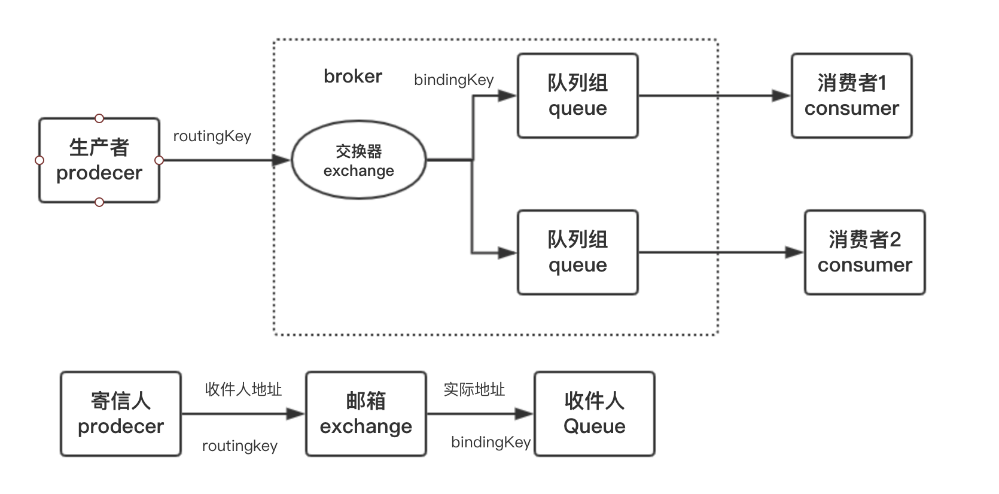

### 随笔记录

### 简介
### 作用
- 解耦 系统之间无需直接对接，生产者与消费者根据消息连接即可
- 削峰/缓冲 可以根据消费者的消费能力适量从消息队列中拉取消息进行消费，异步进行处理
- 可扩展/可恢复 交换器可设置持久化，服务器重启消息不丢失

### 模型
##### P2P 点对点
##### Pub/Sub 发布/订阅
### 协议
- JMS activeMQ
- AQMP RabbitMQ、Kafka

### 主流消息中间件
#### rabbitMQ流程原理
- 生产者：发出消息
- 消费者：消费消息
- broker: 服务节点
    - exchange:交换器
    - 队列

整个过程相当于一次邮件投递过程
1.  生产者生产消息，携带routingKey(相当于寄信地址)
2.  交换器相当于快递员，routingKey=bindingKey的情况下将消息转发到相应队列

交换器的类型
- fanout 将消息投递到绑定的所有队列中
- direct 按照routingKey=bindingKey投递到相应队列中
- topic 支持模糊匹配
- headers

消费消息的两种模式
- push 推
- pull 拉

常见问题

##### 1.如何保证消息的顺序 
broker中存储节点的是队列，先进先出。但是并不能完全保证消息的顺序，比如消息设置了超时时间，进入了死信队列等情况。
##### 2.如何保证消息的可靠性 
- 交换器根据类型有路由键找不到符合条件的队列，会把消息返回给生产者（mandatory=true,否则直接被丢弃）
- 交换器备份
- 持久化，防止在宕机、重启、关闭下数据丢失
    - 交换器
    - 队列
    - 消息
- 确认机制
    - 生产者确认：消息成功投递到对应队列后，返回一个确认码给生产者
    - 消费者确认：消费者收到消息后会给broker确认(ack),收到确认后再从队列中删除该消息
##### 3.rabbitmq怎么实现延迟队列
用TTL(超时时间)和DLX(死信队列)，设置消息的超时时间，消息过期后进入死信队列，消费端后期再统一消费死信队列中的消息
##### 4.生产者很多的时候如何节约性能开销 
多个生产者用多个信道复用一个TCP连接和broker通信
